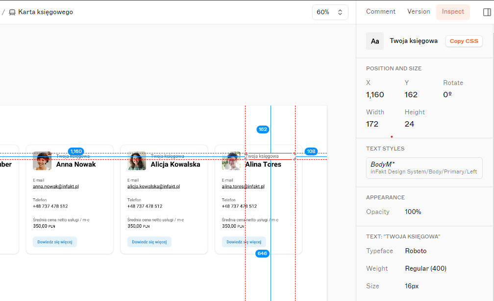

Zadanie testowe na pozycję React Developer

Cel: stworzenie listy kart księgowych, oraz dodanie interakcji po wciśnięciu przycisku.

Makieta: https://www.sketch.com/s/b0736a6b-3a81-4863-95b6-4ec6775a20e3/a/dg1Gl5l
(W boczym menu sketch w prawym górnym rogu w zakładce w zakładce "Inspect" mamy możliwość podglądu właściwości elementów karty księgowego)


Kryteria wykonania:

1. Brak blędów w konsoli przeglądarki
2. Zadanie wykonane w React z użyciem TypeScript
3. Opis Readme znajdujący się z repozytorium zrobionego zadania
4. Projekt powinien zostać udostępniony online na jednej z platform wg. własnego uznania (np. github pages, netlify, vercel, etc.)

Link do API: https://randomuser.me/api/
Używane parametry:

- seed (wartość potrzebna do zachowania wpisów przy paginacji)
- gender
- page
- results

Przykładowy link: https://randomuser.me/api/?seed=abc&gender=female&page=1&results=5

Opis zadania:

Używając danych z dostarczonego publicznego api, stwórz widok wyświetlający listę księgowych. Karta księgowego powinna być stworzona według projektu z załączonego powyżej linku.
Na dole, pod listą kart księgowych, powinien znajdować się przycisk pozwalający na załadowanie kolejnych kart z informacjami o księgowych

Dane księgowego (wyświetlane w karcie księgowego):

```
type AccountantType = {
  cell: string; // numer telefonu
  name: {
    first: string;
    last: string;
  };
  email: string;
  picture: { thumbnail: string; medium: string };
  login: {
    uuid: string;
  };
};
type AccountantResponseType = {
  results: AccountantType[];
  info: {
    page: number;
  };
};

```

Zadanie dodatkowe: umieszczenie widoku kart księgowych na /ksiegowi używając React Router
